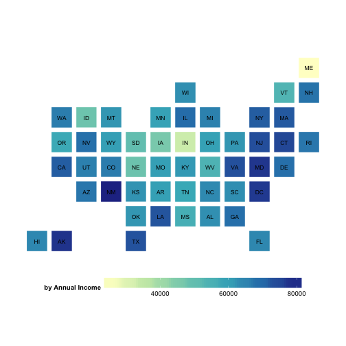

## Overview

Lending Club is "the world’s largest online credit marketplace, facilitating personal loans, business loans, and financing for elective medical procedures. Borrowers access lower interest rate loans through a fast and easy online or mobile interface. Investors provide the capital to enable many of the loans in exchange for earning interest." (https://www.lendingclub.com/public/about-us.action)

Using the data provided by Lending Club for loans issued between 2007 and 2011 (https://www.lendingclub.com/info/download-data.action), this project creates dynamic maps of mean loan amounts, interest rates and annual incomes of loan recipients.

--- 

## Statebins

This project uses the R package statebins to create stylized choropleths of the data. 
For example, the map of mean annual income by state of recipients of loans (Node: embedded R code is being run to create this map): 

 

---

## Discussion

This project might be of interest to those who want to be able to compare levels of income against interest rates assigned or against loan amounts.  

--- 

## Future Development

Future functionality could be developed allowing the user to pick specific time periods of interest or to be able to see more than one map at a time.

